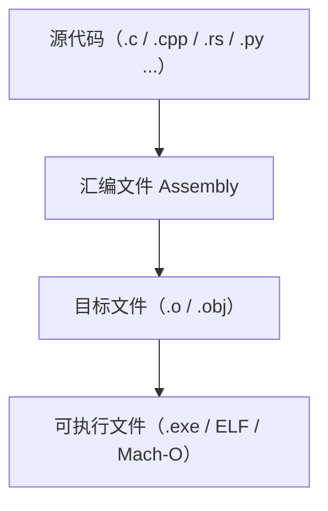

# 写给读者
如果你对编译原理感兴趣却一时找不到合适的学习资料，那么这个教程堪称为你量身定做的。

此外，这个也是完成大型程序项目的入门教程。

**即使是刚刚学习C语言的人也可以轻松阅读本教程。**
## 你将学到
通过这个教程，你将学到：
1. 编译器技术
2. CPU指令集知识
3. 常见的数据结构与算法
4. 如何将庞大的项目拆分为小步骤来完成
5. 如何进行软件测试与版本管理
6. 面对大型项目时应有的心态

## 目标
在这个教程中，我将**用C语言打造一个C语言编译器** （Simple C compiler with C）—— 即能将 C 语言源代码转换为汇编语言的程序，且该编译器本身也采用 C 语言开发。我的首要目标是实现 “自举”，让这款自制编译器能够编译其自身的源代码。

## 编译器（compiler）简介
以hello.c文件为例
```c
#include <stdio.h>
int main (){
    printf("hello world\n");
    return 0;
}
```
hello.c 文件被称为C语言源文件，它首先被C语言**编译器**（如GCC，Clang等）编译为汇编文件hello.s。

汇编文件hello.s可能如下（现在没必要逐行看懂，混个脸熟就行了，慢慢地你会对它非常熟悉）
```bash
	.file	"hello.c"
	.section	.rodata
.LC0:
	.string	"hello world"
	.text
	.globl	main
	.type	main, @function
main:
.LFB0:
	.cfi_startproc
	pushq	%rbp
	.cfi_def_cfa_offset 16
	.cfi_offset 6, -16
	movq	%rsp, %rbp
	.cfi_def_cfa_register 6
	movl	$.LC0, %edi
	call	puts
	movl	$0, %eax
	popq	%rbp
	.cfi_def_cfa 7, 8
	ret
	.cfi_endproc
.LFE0:
	.size	main, .-main
	.ident	"GCC: (Ubuntu 9.4.0-1ubuntu1~20.04.1) 9.4.0"
	.section	.note.GNU-stack,"",@progbits
```
汇编文件（.s）本质上是人类可读的机器指令描述。

接下来，它会被 汇编器（Assembler） 汇编为二进制的 目标文件hello.o（Object File，扩展名为 .o）

广义地说，汇编器也是一种编译器，他把汇编语言源文件翻译为二进制机器指令。

hello.o中包含已经可以被 CPU 执行的指令。


不过，其中对 printf 这样的标准库函数只是引用（symbol reference），函数本体并不在 hello.o 里。

链接器（Linker）会在下一步中，将 printf 所在的标准库（例如 libc）的目标代码与 hello.o 合并，生成最终的可执行文件（如 Linux 下的 hello 或 Windows 下的 hello.exe）



## 教程思路
编译器在概念上可划分为语法分析、中间处理、代码生成等多个阶段。传统教材常按阶段分章节讲解，但这种方式容易导致内容过于深入晦涩，读者难以跟上节奏。


此外，按阶段分步开发的模式存在明显缺陷：
1. 在所有阶段全部完成前，无法实际运行编译器。这意味着在编译器能动起来之前，你可能都察觉不到自己在前面的阶段哪里理解错了、代码哪里写错了。
2. 在没看到下个阶段需要的输入格式之前，你也很难知道前一阶段应该输出什么。
3. 在编译器“真正能编译代码”之前的漫长时间里，很难保持学习的动力。

为了避开这些陷阱，我采用了另一种方法：

在最初阶段，我将实现一种极其简单的“自制语言”。它的语言功能很有限，所以即使你对编译器原理一无所知，也能看懂并跟着实现它。之后，随着学习的深入，我会逐步为这门语言增加功能，最终让它成长为与C语言一致的语言。

我相信通过这种方式，即使是刚刚学习C语言的读者也能轻松的跟上我的节奏，从而收获得更快更多。

## 一个有趣的问题
从上文对编译器的介绍，我们可以知道，编译器本质也是一个程序。

既然一般的程序都需要经过编译，那么第一个编译器是用什么编译出来的呢？

它是第一个编译器，也就是说，程序员写好这个编译器的程序后，没有现成的编译器可以用来编译这个源文件。
没有第一个编译器，程序员也无法编译其他任何程序。

我们用C语言编写一个C语言的编译器，然后再用一个现成的、功能更加完善的编译器来编译我们的编译器文件，这种行为感觉缺乏意义。————既然已经有编译器了，何必再写一个呢？
然而，事实并非如此。

事实上：

>C 编译器由 C 实现——这种自我引用的现象并不罕见。

>许多语言的实现都用该语言自身编写。

>如果某语言 X 已经有现成的编译器，那么使用 X 来写新的 X 编译器没有逻辑矛盾。

>在这种情况下，只需使用旧编译器完成新版本，然后在完成后切换即可。新写的编译器往往有着更好的性能和更完整的功能。

>本教程所做的事情正是如此。

>但如果语言 X 还没有任何实现，那就只能用另一种语言 Y 来编写第一个 X 编译器。

>当它成熟后，再将自身从 Y 重写为 X。

>这正是许多语言在诞生初期的做法。

>沿着现代编译器的谱系一路追溯，我们最终会发现，它们的祖先是某位先驱在计算机早期直接用机器码编写的汇编器。

>也许那个原始汇编器有多个版本，也许只有一个——但毫无疑问，今天存在的所有编译器都源自那极少数的祖先。

>而几乎所有可执行文件，都是这些早期汇编器的“后代”。

>这就像“软件界的生命起源”一样，充满浪漫与哲理。